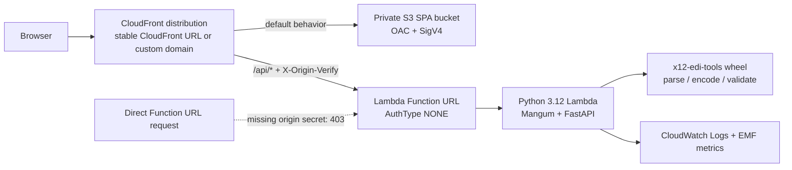

# X12 Parser Encoder

[](docs/coverage.md)
[](https://github.com/Kartik-Hirijaganer/X12-Parser-Encoder/actions/workflows/ci.yml)
[](LICENSE)

Python-native tooling for X12 270/271 eligibility workflows: a reusable parsing and validation library, a FastAPI backend, and a React workbench for spreadsheet-to-X12 and 271 dashboard workflows.

## Architecture At A Glance



## What Is X12 EDI?

X12 is the transaction format used by US healthcare trading partners to exchange structured claims, eligibility, remittance, and enrollment data. In this repository, the focus is the 270 eligibility inquiry and 271 eligibility response pair used to ask a payer for coverage status and interpret the response safely.

## Release Info

<!-- version-table:start -->
| Artifact | Version |
| --- | --- |
| Monorepo | `0.1.1` |
| Python package | `0.1.1` |
| API app | `0.1.1` |
| Web app | `0.1.1` |
<!-- version-table:end -->

## Releases

GitHub Releases are the canonical distribution channel. A validated `v*.*.*` tag publishes the Python package, GHCR image, Lambda zip with SHA256, and Terraform modules tarball with SHA256. See [docs/runbooks/cutting-a-release.md](docs/runbooks/cutting-a-release.md) for the release checklist and rollback commands.

## Project Structure

<!-- autogen:project-structure:start -->
| Path | Purpose |
| --- | --- |
| `packages/x12-edi-tools` | Framework-agnostic Python library for parsing, encoding, validation, payer profiles, and public types |
| `apps/api` | FastAPI Lambda/container adapter exposing upload, generation, validation, parse, export, health, profile, and pipeline endpoints |
| `apps/web` | React workbench for settings management, preview, generation, validation, templates, and eligibility dashboards |
| `infra/terraform` | Terraform modules and staging/production environments for S3, CloudFront, Lambda, WAF, observability, and custom domains |
| `docs` | Architecture, API, design, runbook, diagram, and ADR documentation |
| `scripts` | Release, packaging, Terraform helper, Lambda pruning, and documentation regeneration scripts |
| `.github/workflows` | CI, deploy, release, Terraform, and documentation drift workflows |
<!-- autogen:project-structure:end -->

## Installation

### From Source

```bash
make install
```

This installs the local `packages/x12-edi-tools` library in editable mode along with the FastAPI app and web dependencies.

To install only the local Python library from a checkout:

```bash
pip install -e "./packages/x12-edi-tools[all]"
```

### Package Name Note

This repository includes its own in-tree Python package at `packages/x12-edi-tools`, imported as `x12_edi_tools` by the API app. The package name `x12-edi-tools` is also used by an unrelated third-party project on PyPI, so do not use `pip install x12-edi-tools` when setting up this repository unless the package publishing strategy has been updated.

The Docker images and local `make install` target install the library from this repository path, not from PyPI.

Optional local extras use the same path-based install form:

```bash
pip install -e "./packages/x12-edi-tools[excel]"
pip install -e "./packages/x12-edi-tools[pandas]"
pip install -e "./packages/x12-edi-tools[all]"
```

## Quick Start

```python
from pathlib import Path

from x12_edi_tools import encode, parse, validate

raw_x12 = Path("request.270").read_text(encoding="utf-8")
parse_result = parse(raw_x12, strict=False, on_error="collect")
interchange = parse_result.interchange

validation = validate(interchange, profile="dc_medicaid", levels={1, 2, 3, 4, 5})
assert validation.is_valid

roundtripped = encode(interchange)
Path("roundtrip.270").write_text(roundtripped, encoding="utf-8")
```

## API Reference Summary

<!-- autogen:api-endpoints:start -->
| Endpoint | Purpose |
| --- | --- |
| `POST /api/v1/convert` | Convert a canonical spreadsheet or delimited file into normalized patient JSON. |
| `POST /api/v1/export/validation/xlsx` | Export validation results as an Excel workbook. |
| `POST /api/v1/export/xlsx` | Export parsed eligibility results as an Excel workbook. |
| `POST /api/v1/generate` | Generate one or more X12 270 payloads from patient JSON and config. |
| `GET /api/v1/health` | Run the deep phase-5 health check. |
| `POST /api/v1/parse` | Parse a raw 271 file into dashboard-friendly JSON. |
| `POST /api/v1/pipeline` | Run convert -> generate -> validate in a single request. |
| `GET /api/v1/profiles` | List all built-in payer profiles. |
| `GET /api/v1/profiles/{name}/defaults` | Return the default configuration values for a payer profile. |
| `GET /api/v1/templates/{name}` | Download one canonical import template or the template specification. |
| `POST /api/v1/validate` | Validate a raw X12 file against generic SNIP rules and payer rules. |
| `GET /healthz` | Healthcheck |
<!-- autogen:api-endpoints:end -->

## Web Application Usage

1. Open the home page and choose generate, validate, or parse.
2. Configure submitter and payer defaults on the Settings page. Only configuration lives in `localStorage`.
3. Upload a spreadsheet to preview corrections and row-level errors before generation, or upload raw X12 for validate and parse flows.
4. Download generated X12, ZIP batches, or Excel eligibility exports from the result screens.

## Templates

- `apps/api/templates/eligibility_template.csv`
- `apps/api/templates/eligibility_template.xlsx`
- `apps/api/templates/template_spec.md`

The template spec defines canonical column names, required inputs, and the normalization rules applied by the API before X12 generation.

## Development Setup

```bash
make install
make lint
make typecheck
make test
make coverage
```

Useful maintenance commands:

- `python scripts/check_version_sync.py`
- `python scripts/check_no_proprietary_content.py`
- `python scripts/bump_version.py patch`
- `make docs-regenerate`
- `make docs-check`

## Deployment Guide

### Docker

```bash
docker build -f docker/Dockerfile -t x12-parser-encoder .
docker run --rm -p 8000:8000 x12-parser-encoder
```

### Web + API

- AWS deploys use the Terraform serverless stack:
  - React frontend: private S3 bucket, served by CloudFront.
  - FastAPI backend: Python 3.12 Lambda Function URL behind the same CloudFront distribution.
- Local deploys require an explicit environment:

```bash
make deploy ENV=staging
make deploy ENV=production
```

- GitHub Actions deploys use the `Deploy` workflow:
  - pushes to `main` deploy to `staging` when deploy-affecting paths change;
  - production is manual only through `workflow_dispatch` with `environment=production`.
- Required GitHub Actions configuration:
  - repository variable `AWS_ACCOUNT_ID`;
  - optional repository variables `AWS_REGION`, `APP_NAME`, and `LAMBDA_ARCHITECTURE`;
  - environment secret `TERRAFORM_TFVARS` for each GitHub environment (`staging`, `production`), containing the matching `infra/terraform/environments/<env>/terraform.tfvars` content.
`Deploy` and `Release` are intentionally separate workflows. `Deploy` updates the running AWS
application for users. `Release` runs only for `v*.*.*` tags and publishes distributable artifacts
such as the Python package and GitHub release notes; it does not deploy the hosted AWS app.

### Fork And Deploy To Your Own AWS Account

1. Fork the repository and create a working branch.
2. Run `make install`, then `make test` locally.
3. Bootstrap Terraform state once:

```bash
bash scripts/bootstrap_tf_backend.sh
```

4. Copy the matching example tfvars file and set account-specific values:

```bash
cp infra/terraform/environments/staging/terraform.tfvars.example infra/terraform/environments/staging/terraform.tfvars
```

5. Add repository variable `AWS_ACCOUNT_ID`, optional variables `AWS_REGION`, `APP_NAME`, and `LAMBDA_ARCHITECTURE`, and one `TERRAFORM_TFVARS` environment secret per deploy environment.
6. Deploy from your machine with `make deploy ENV=staging`, or run the `Deploy` workflow manually with `workflow_dispatch`.
7. Read [docs/runbooks/open-source-fork.md](docs/runbooks/open-source-fork.md) for the command-forward checklist.

## PHI Handling Notes

- No real patient data belongs in tests, fixtures, or logs.
- Uploaded files are processed in memory and not persisted to disk.
- Structured logs carry correlation IDs, endpoint names, status codes, durations, and sanitized upload metadata only.
- Browser storage is limited to submitter and payer configuration; workflow data stays in memory.
- See [SECURITY.md](SECURITY.md) for the retention policy and production readiness gate.

## Contributing

See [CONTRIBUTING.md](CONTRIBUTING.md) for branch workflow, quality gates, documentation rules, and release expectations.

## License

MIT. See [LICENSE](LICENSE).
