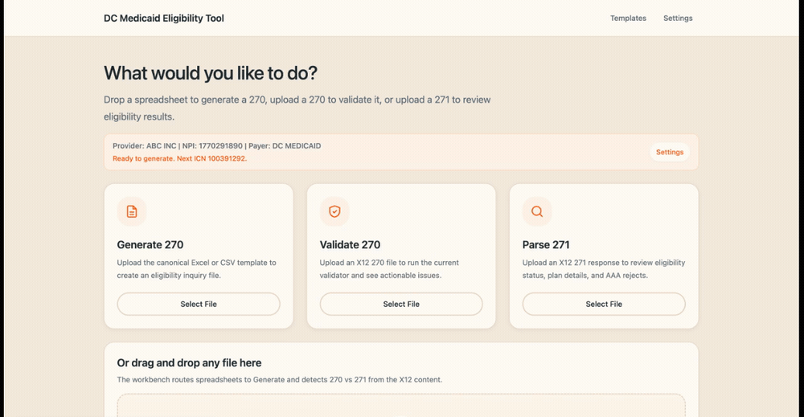
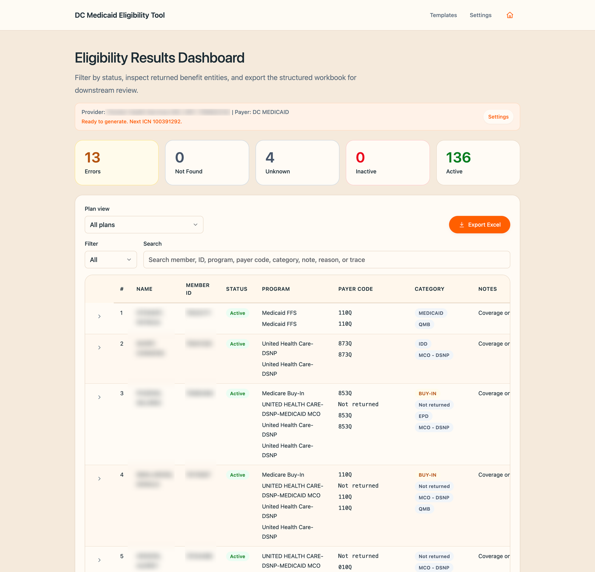
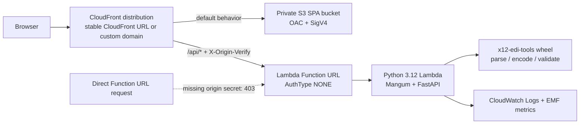

# Medicaid & Medicare Eligibility Automation

> **Spreadsheet in, insurance answers out.** A full-stack toolkit that turns a billing team's everyday spreadsheet into validated healthcare EDI — then reads the insurer's response back as a dashboard humans can actually use.

[](docs/coverage.md)
[](https://github.com/Kartik-Hirijaganer/X12-Parser-Encoder/actions/workflows/ci.yml)
[](LICENSE)


**[🔗 Live demo](https://d1o6w6oygv7w3m.cloudfront.net/)**  ·  **[🐍 Quick start](#-quick-start)**  ·  **[🏗️ How it works](#-how-it-works)**

<p align="center">
  
</p>

<p align="center"><sub>Drop in an X12 <strong>271</strong> response → a readable eligibility dashboard in seconds. <em>(Synthetic data.)</em></sub></p>

A healthcare provider's billing team verifies, every single day, whether each patient's insurance is active before services are rendered. This project automates that loop end to end: it generates **X12 270** eligibility inquiries from a spreadsheet, validates them before they ever reach the payer, and parses the **271** responses into a dashboard that says — in plain English — who's covered, who isn't, and *why*.

I built the whole thing — the Python library, the API, the web app, and the AWS infrastructure — as a side project to take a slow, error-prone manual task off my company's billing team.

## 💡 Why this exists

Before this tool, checking eligibility meant an analyst logging into the payer portal and typing member IDs **one at a time**. It was slow, and worse: a single fat-fingered date of birth or misspelled name would sail through quietly and turn into a **claim denial weeks later** — after the service was already delivered and the money was hard to recover.

So I built something that does three things the manual process couldn't:

- **Checks eligibility in bulk** — drop a whole spreadsheet, get answers for everyone at once, and catch ineligible patients *before* services are rendered.
- **Validates before sending** — SNIP level 1–5 checks plus payer-specific rules catch malformed requests before the payer rejects them.
- **Decodes the payer's rejection codes into plain English** — instead of a cryptic reject code, the billing team sees *"the date of birth you submitted doesn't match what DC Medicaid has on file."* Data-entry mistakes get fixed at the source instead of becoming denials.

## 📈 Impact

> Used by a real billing team on real claims.

- **Helped lift first-pass claim acceptance to ~94%** — bulk eligibility checks meant ineligible patients were caught up front, so the team could stop or re-route services instead of billing into a denial.
- **Cut denials caused by data mismatches** — decoding reject codes pinpointed the exact field (DOB, name, member ID) that disagreed with the payer's records, which doubled as a data-entry quality check.
- **Turned a one-at-a-time portal task into a single upload** — minutes of manual lookups per batch became one spreadsheet drop.

## ✨ What it does

| | |
|---|---|
| 📤 **Spreadsheet → 270** | Drop a billing spreadsheet and get compliant X12 270 eligibility inquiries. Dates, names, and whitespace are auto-corrected; risky values are surfaced for confirmation rather than silently changed. |
| ✅ **Validate before you send** | Layered SNIP 1–5 validation plus payer-profile rules (e.g. DC Medicaid) catch problems before the payer does. |
| 📥 **271 → dashboard** | Parses the payer's 271 response into a readable eligibility dashboard — coverage status per patient, filterable and exportable to Excel. |
| 🧩 **Decoded errors** | Translates reject / AAA / error codes into plain-language reasons and the exact mismatched field. |
| 🔁 **Roundtrip-safe** | Parse → inspect → re-encode without corrupting control numbers or delimiters. |
| 🔌 **Three ways to use it** | A reusable Python library, a REST API, or the web workbench — same engine underneath. |

<details>
<summary><strong>New to healthcare EDI? (30-second version)</strong></summary>

<br>

**X12** is the decades-old standard format US healthcare partners use to exchange claims, eligibility, and remittance data. A **270** is the question — *"is this patient covered?"* — and the **271** is the payer's answer. Both are dense, delimiter-packed text files that are painful to read by hand. This project turns the question into something you can generate from a spreadsheet, and the answer into something you can read on a screen.

</details>

## 📊 A closer look

The parsed **271** dashboard: per-patient coverage status, payer codes, and decoded reject categories — filterable, searchable, and exportable to Excel.

<p align="center">
  
</p>

Want to click through it yourself? Try the **[live demo](https://d1o6w6oygv7w3m.cloudfront.net/)** — synthetic data only.

<!--
  📸 Optional addition later (synthetic / masked data ONLY):
    - docs/screenshots/preview.png — spreadsheet preview with row-level corrections/errors
  ⚠️ Never commit a real patient name, member ID, or DOB.
-->

## 🏗️ How it works

The data flow, end to end:

```
billing spreadsheet  →  X12 270 inquiry  →  payer  →  X12 271 response  →  eligibility dashboard
                         (generated + validated)        (parsed + decoded)
```

It ships as three deliverables that share one release train — a reusable library, the API that wraps it, and the web app that consumes the API. In production it runs as a single same-origin AWS serverless stack:


```mermaid
flowchart LR
  browser["Browser"] --> cloudfront["CloudFront distribution<br/>stable CloudFront URL or custom domain"]
  cloudfront -->|default behavior| s3["Private S3 SPA bucket<br/>OAC + SigV4"]
  cloudfront -->|/api/* + X-Origin-Verify| lambda_url["Lambda Function URL<br/>AuthType NONE"]
  lambda_url --> lambda["Python 3.12 Lambda<br/>Mangum + FastAPI"]
  lambda --> library["x12-edi-tools wheel<br/>parse / encode / validate"]
  lambda --> logs["CloudWatch Logs + EMF metrics"]
  direct["Direct Function URL request"] -. "missing origin secret: 403" .-> lambda_url
```

- **`packages/x12-edi-tools`** — the framework-agnostic Python library: parsing, encoding, SNIP 1–5 validation, payer profiles, and typed models.
- **`apps/api`** — a FastAPI service that wraps the library and owns uploads, correlation IDs, origin-secret checks, and metrics.
- **`apps/web`** — the React + Vite workbench: settings, spreadsheet preview, generation, validation, and the eligibility dashboard.

More detail in [docs/architecture.md](docs/architecture.md).

## 🧰 Built with

- **Library** — Python 3.11+, Pydantic v2, fully typed (mypy `--strict`), property-based tests with Hypothesis
- **API** — FastAPI, Mangum (Lambda ASGI), Prometheus / CloudWatch EMF metrics
- **Web** — React, TypeScript, Vite, Tailwind v4, React Router v7
- **Infra & CI** — AWS Lambda · CloudFront · S3 · WAF, Terraform, Docker, GitHub Actions

## 🐍 Quick start

**As a Python library:**

```python
from pathlib import Path
from x12_edi_tools import encode, parse, validate

raw_x12 = Path("request.270").read_text(encoding="utf-8")
parse_result = parse(raw_x12, strict=False, on_error="collect")
interchange = parse_result.interchange

validation = validate(interchange, profile="dc_medicaid", levels={1, 2, 3, 4, 5})
assert validation.is_valid

roundtripped = encode(interchange)
Path("roundtrip.270").write_text(roundtripped, encoding="utf-8")
```

**As a full stack, locally:**

```bash
make install                                   # bootstrap library + API + web
cd apps/api && uvicorn app.main:app --reload   # API on :8000
cd apps/web && npm run dev                      # web on :5173
```

Or run the whole thing in a container:

```bash
docker build -f docker/Dockerfile -t x12-parser-encoder .
docker run --rm -p 8000:8000 x12-parser-encoder
```

## 🔬 Engineering highlights

A few things I'm proud of under the hood:

- **Monorepo, three deliverables, one release train** — library, API, and web are versioned together and released through a single automated pipeline.
- **Quality gates that actually gate** — `mypy --strict`, plus CI-enforced coverage floors (95% library / 85% API).
- **Property-based testing** — Hypothesis fuzzes the parser ↔ encoder roundtrip so malformed-but-legal X12 doesn't slip through.
- **HIPAA-conscious by design** — stateless, in-memory processing; no database or server-side file retention; correlation IDs and sanitized metadata in logs, never PHI.
- **Production serverless** — same-origin CloudFront, origin-secret-gated Lambda Function URL, WAF, and observability via CloudWatch EMF metrics.
- **Docs that can't silently rot** — architecture diagrams, API tables, and an ERD are generated and drift-checked in CI, alongside ADRs for the load-bearing decisions.

## 📂 Project internals & reference

<details>
<summary><strong>Project structure</strong></summary>

<!-- autogen:project-structure:start -->
| Path | Purpose |
| --- | --- |
| `packages/x12-edi-tools` | Framework-agnostic Python library for parsing, encoding, validation, payer profiles, and public types |
| `apps/api` | FastAPI Lambda/container adapter exposing upload, generation, validation, parse, export, health, profile, and pipeline endpoints |
| `apps/web` | React workbench for settings management, preview, generation, validation, templates, and eligibility dashboards |
| `infra/terraform` | Terraform modules and staging/production environments for S3, CloudFront, Lambda, WAF, observability, and custom domains |
| `docs` | Architecture, API, design, runbook, diagram, and ADR documentation |
| `scripts` | Release, packaging, Terraform helper, Lambda pruning, and documentation regeneration scripts |
| `.github/workflows` | CI, deploy, release, Terraform, and documentation drift workflows |
<!-- autogen:project-structure:end -->

</details>

<details>
<summary><strong>API reference</strong></summary>

<!-- autogen:api-endpoints:start -->
| Endpoint | Purpose |
| --- | --- |
| `POST /api/v1/convert` | Convert a canonical spreadsheet or delimited file into normalized patient JSON. |
| `POST /api/v1/export/validation/xlsx` | Export validation results as an Excel workbook. |
| `POST /api/v1/export/xlsx` | Export parsed eligibility results as an Excel workbook. |
| `POST /api/v1/generate` | Generate one or more X12 270 payloads from patient JSON and config. |
| `GET /api/v1/health` | Run the deep phase-5 health check. |
| `POST /api/v1/parse` | Parse a raw 271 file into dashboard-friendly JSON. |
| `POST /api/v1/pipeline` | Run convert -> generate -> validate in a single request. |
| `GET /api/v1/profiles` | List all built-in payer profiles. |
| `GET /api/v1/profiles/{name}/defaults` | Return the default configuration values for a payer profile. |
| `GET /api/v1/templates/{name}` | Download one canonical import template or the template specification. |
| `POST /api/v1/validate` | Validate a raw X12 file against generic SNIP rules and payer rules. |
| `GET /healthz` | Healthcheck |
<!-- autogen:api-endpoints:end -->

Web app flow: configure submitter/payer defaults on **Settings**, upload a spreadsheet to preview row-level corrections before generation (or upload raw X12 for the validate/parse flows), then download generated X12, ZIP batches, or Excel exports from the result screens. Only non-PHI configuration is stored in the browser (`localStorage` key `x12_submitter_config`).

</details>

<details>
<summary><strong>Versions & releases</strong></summary>

<!-- version-table:start -->
| Artifact | Version |
| --- | --- |
| Monorepo | `1.2.0` |
| Python package | `1.2.0` |
| API app | `1.2.0` |
| Web app | `1.2.0` |
<!-- version-table:end -->

GitHub Releases are the canonical distribution channel. A validated `v*.*.*` tag publishes the Python package, GHCR image, Lambda zip (with SHA256), and Terraform modules tarball. See [docs/runbooks/cutting-a-release.md](docs/runbooks/cutting-a-release.md) for the release checklist and rollback commands.

> **Note on the package name:** this repo ships its own in-tree `packages/x12-edi-tools` (imported as `x12_edi_tools`). The name `x12-edi-tools` is also used by an unrelated PyPI project, so install from this checkout (`pip install -e "./packages/x12-edi-tools[all]"`), not from PyPI.

</details>

<details>
<summary><strong>Development & deployment</strong></summary>

```bash
make install      # bootstrap venv + library + API + web deps
make lint         # ruff (lib & api) + eslint (web)
make typecheck    # mypy --strict (lib & api) + tsc --noEmit (web)
make test         # lib + api + web
make coverage     # enforces coverage floors
```

**Deploy to your own AWS account:**

1. Fork the repo and run `make install` then `make test`.
2. Bootstrap Terraform state once: `bash scripts/bootstrap_tf_backend.sh`.
3. Copy `infra/terraform/environments/staging/terraform.tfvars.example` → `terraform.tfvars` and set account-specific values.
4. Add repository variable `AWS_ACCOUNT_ID` (plus optional `AWS_REGION`, `APP_NAME`, `LAMBDA_ARCHITECTURE`) and one `TERRAFORM_TFVARS` environment secret per environment.
5. Deploy with `make deploy ENV=staging`, or run the `Deploy` GitHub Actions workflow.

`Deploy` (updates the running app) and `Release` (publishes versioned artifacts) are intentionally separate workflows. Full checklist in [docs/runbooks/open-source-fork.md](docs/runbooks/open-source-fork.md).

</details>

<details>
<summary><strong>PHI handling</strong></summary>

- No real patient data in tests, fixtures, logs, or screenshots.
- Uploaded files are processed in memory and never persisted to disk.
- Structured logs carry correlation IDs, endpoint names, status codes, durations, and sanitized upload metadata only.
- Browser storage is limited to non-PHI submitter/payer configuration.

See [SECURITY.md](SECURITY.md) for the retention policy and production readiness gate.

</details>

## 🤝 Contributing

See [CONTRIBUTING.md](CONTRIBUTING.md) for the branch workflow, quality gates, documentation rules, and release expectations.

## 📄 License

MIT — see [LICENSE](LICENSE).

---

<sub>Built end to end (library · API · web · infra) as a side project to make a healthcare billing team's day a little less painful.</sub>
