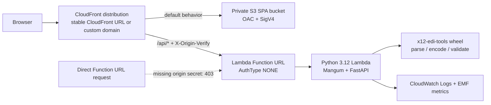
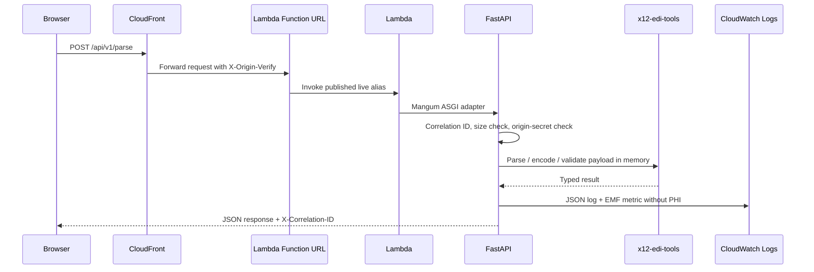

# Architecture

## Target State

The production application is a single same-origin CloudFront distribution. The default behavior serves the React SPA from a private S3 bucket through origin access control. The `/api/*` behavior forwards to a Lambda Function URL and injects `X-Origin-Verify`; FastAPI rejects missing or mismatched origin secrets before doing application work.

## Request Sequence

## Why Serverless

The serverless stack is the lowest-complexity way to keep one stable public endpoint, same-origin browser calls, low idle cost, and HIPAA-eligible AWS services. The decision record is [ADR-001: Serverless API and Frontend Hosting](plans/ADR-001-serverless.md), which captures the hosting tradeoffs, the origin-secret choice, and the reason the default path stays AWS-first.

## Statelessness Contract

- No database, queue, cache, or server-side file retention is part of the runtime architecture.
- Uploaded files are read into memory, size checked, hashed only for sanitized audit metadata, processed, and discarded.
- Raw X12 payloads, filenames, patient names, member identifiers, and other PHI-bearing values are not logged.
- Browser storage is limited to non-PHI submitter and payer configuration. Workflow data stays in React state.
- `/metrics` remains a local/container Prometheus endpoint. Lambda emits CloudWatch Embedded Metric Format log lines instead.

## Deliverable Boundaries

- `packages/x12-edi-tools` is the reusable Python library. It owns X12 parsing, encoding, validation, typed models, and payer profiles.
- `apps/api` is the HTTP adapter. It owns request validation, multipart upload handling, correlation IDs, sanitized logging, metrics emission, and response shaping.
- `apps/web` is the React workbench. It owns workflow state, settings UI, upload affordances, previews, dashboards, and exports.
- `infra/terraform` owns the AWS control plane: S3, CloudFront, Lambda, Function URL, WAF, observability, and optional custom domain resources.

## API Surface

<!-- autogen:api-endpoints:start -->
| Endpoint | Purpose |
| --- | --- |
| `POST /api/v1/convert` | Convert a canonical spreadsheet or delimited file into normalized patient JSON. |
| `POST /api/v1/export/validation/xlsx` | Export validation results as an Excel workbook. |
| `POST /api/v1/export/xlsx` | Export parsed eligibility results as an Excel workbook. |
| `POST /api/v1/generate` | Generate one or more X12 270 payloads from patient JSON and config. |
| `GET /api/v1/health` | Run the deep phase-5 health check. |
| `POST /api/v1/parse` | Parse a raw 271 file into dashboard-friendly JSON. |
| `POST /api/v1/pipeline` | Run convert -> generate -> validate in a single request. |
| `GET /api/v1/profiles` | List all built-in payer profiles. |
| `GET /api/v1/profiles/{name}/defaults` | Return the default configuration values for a payer profile. |
| `GET /api/v1/templates/{name}` | Download one canonical import template or the template specification. |
| `POST /api/v1/validate` | Validate a raw X12 file against generic SNIP rules and payer rules. |
| `GET /healthz` | Healthcheck |
<!-- autogen:api-endpoints:end -->

## Generated Diagrams

- Authored Mermaid sources live under `docs/diagrams/authored/`.
- Generated diagram sources and rendered graphs live under `docs/diagrams/generated/`.
- `make docs-regenerate` is the authoritative write path for generated docs.
- `make docs-check` verifies the generated docs are clean without touching the working tree.
